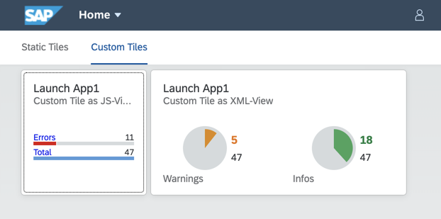

# portal-custom-tile

This is the repository for deep dive into Fiori Launchpad Custom Tiles.

It refers to the blog at the SAP Community:
[Custom Tiles with Cloud Foundry Portal – Cloud Platform](https://blogs.sap.com/2020/03/23/custom-tiles-with-cloud-foundry-portal-cloud-platform/)

## What You Get After Deployment

- Portal instance with 3 tiles (1 static, 2 custom tiles)
- all 3 tiles link to one basic UI5 app with no content
- one CAP based HANA-DB/Service, with some sample data for the tiles

## Run Locally

Install Node dependencies

- `npm install`

For inital creation of the database, it's necessary to build the
DB once:

- `npm run cds:build`

After that the CDS server can be started

- `npm run cds:watch`

Now, either the first custom tile or the second can be served via the UI5-tooling:

- `npm run ui5:serve:tile1`
- `npm run ui5:serve:tile2`

## Build & Deploy to Your Cloud Foundry space

- `npm run mta:build && npm run mta:deploy`

If you want to deploy it to a SAP Cloud Platform Trial account,
you'll need to uncomment `service` & `service-plan` in file: **mta.yaml**.
